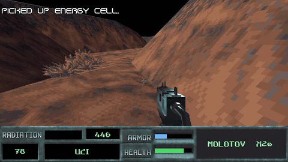
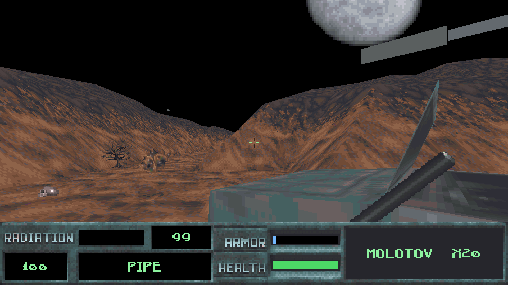
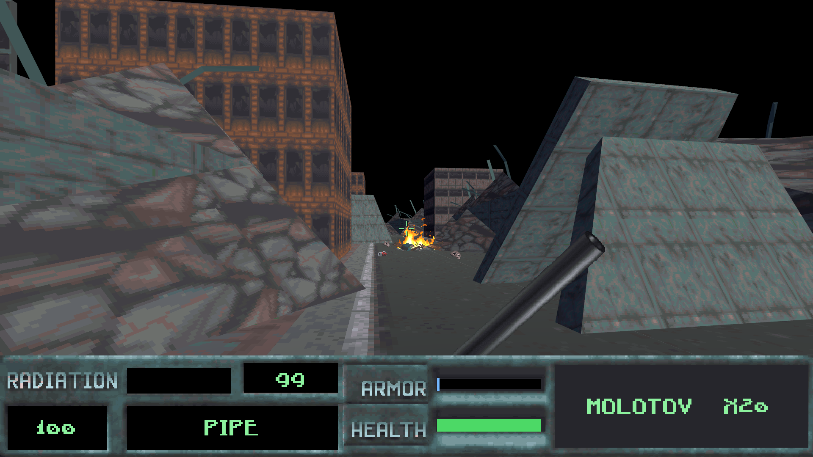
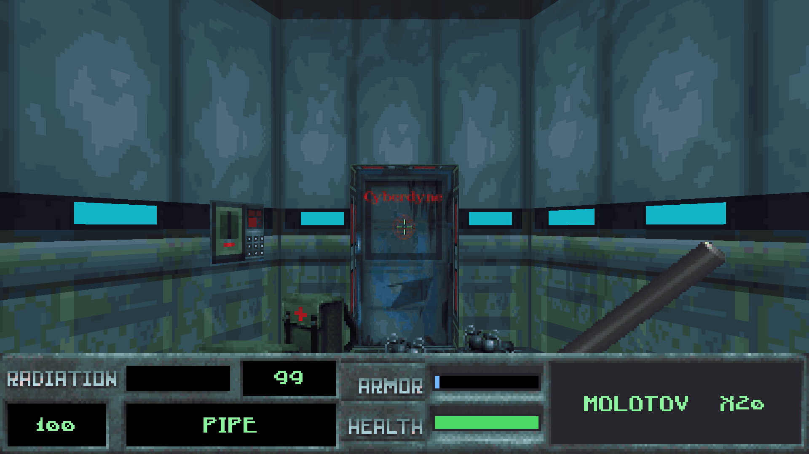
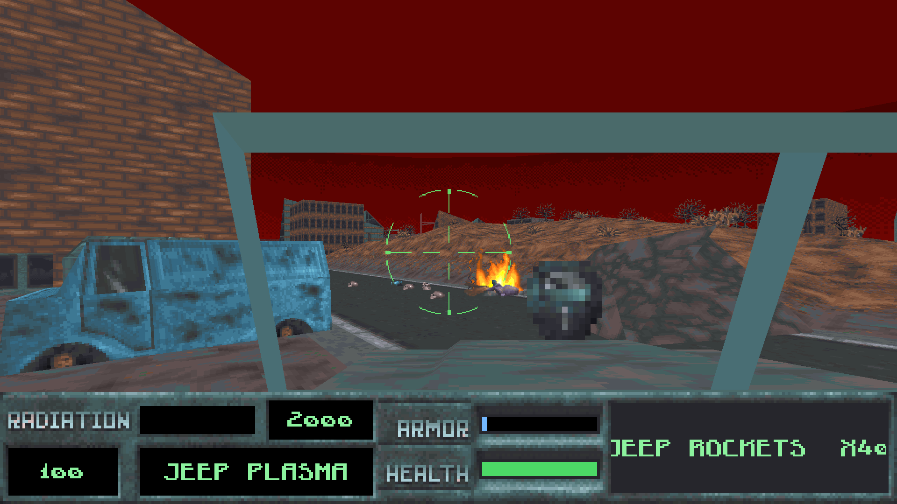
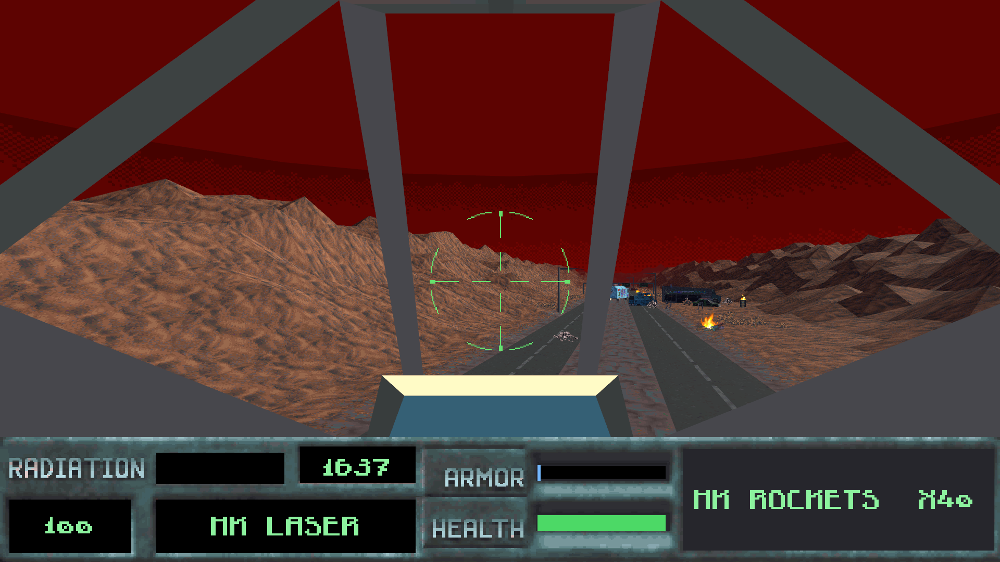
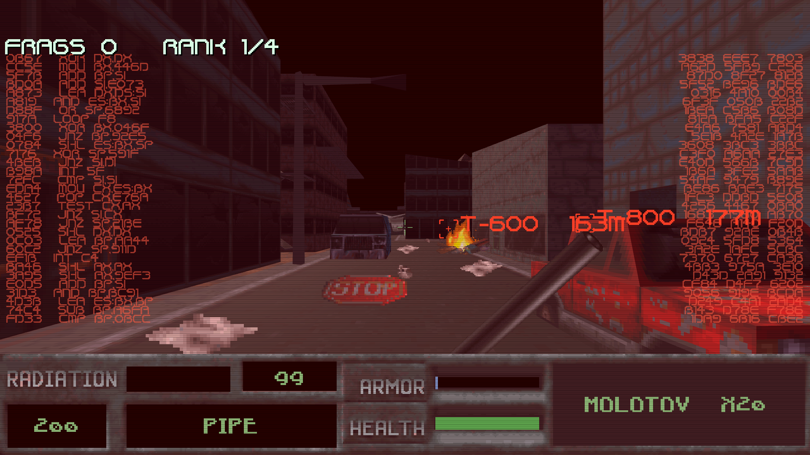
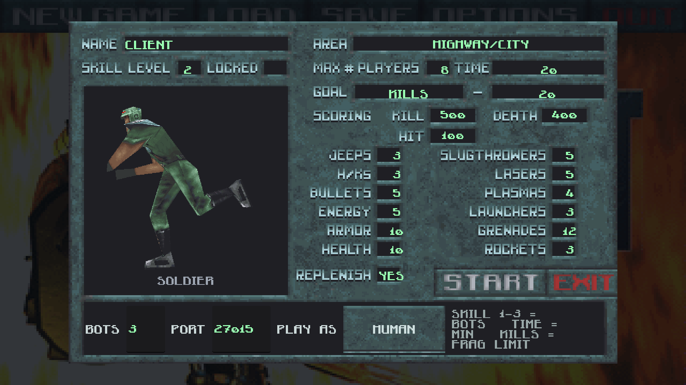
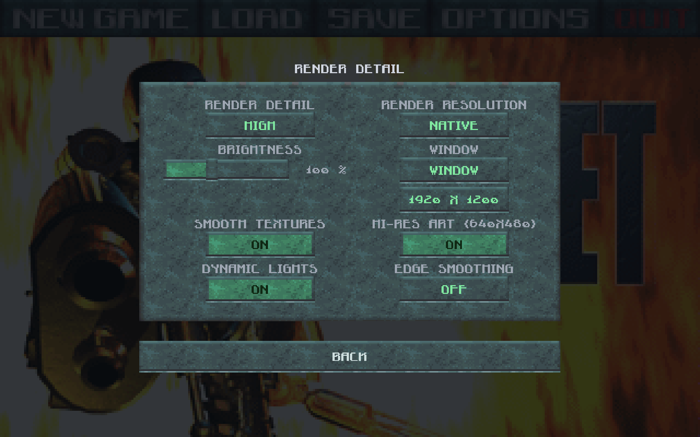

# skynet-godot

A Godot 4 port of the two 1996 XnGine shooters by Bethesda Softworks —
*SkyNET* and *Future Shock*. The engine is rewritten in Godot; the game
itself is read from **your own copy** of the original data: the BSA
archives, the WLD heightmaps, the TEXTURE files, the maps, the sounds and
the HMI music, all decoded at run time.

Nothing from the original games is included here. You need the games.



*Mission one: out of the canyon, and the complex comes into view.*

## Screenshots

| | |
| --- | --- |
|  |  |
|  |  |
|  |  |
|  |  |

Left to right, top to bottom: mission 1's canyon under the moon; the
ruined city; the Cyberdyne building; the jeep with its own HUD; the HK
flying the highway with the convoy ahead; a deathmatch seen through the
TERMINATOR class's machine vision; the network setup screen, whose left
box turns the body you will play as; and the render settings, cut out of
the original dialog art.

## What works

- **The campaign** — all eight missions, the DOS mission scripts, the
  objective counter, briefings with the original art and voice lines. A
  mission is held as *one* scene — its outdoor world and every interior
  it reaches — so a doorway moves you instead of loading the next map,
  and what you left behind is still there when you come back.
- **The world** as the original drew it: DOS heightmap terrain, the
  entity meshes, billboard sprites, palette-accurate textures, the night
  sky with the moon, the dusk dome on missions 5–8.
- **The rules read out of the DOS executable**, not guessed: door and
  lift movers, proximity gates and chains, destructibles with their
  damage stages, teleports, water levels that rise and fall, spawn
  points, the jeep's and the HK's handling, enemy AI states and their
  animation scripts, weapon cadences and ammo pools, cheats.
- **Vehicles** — the jeep and the HK, with the DOS cockpits.
- **Deathmatch** over LAN with bots, HUMAN and TERMINATOR classes,
  machine vision and the motion detector, the original arenas.
- **Looks the original could not manage**, each off by default so the
  port still starts as DOS drew it: dynamic lights from the gunfire, the
  explosions and the rounds in flight (which also lights the street
  lamps the DOS renderer only drew as bright pixels — 93 of them on the
  highway map), edge smoothing, smooth texture filtering, the game's own
  640x480 HUD and weapon art, a brightness dial, and a render scale that
  can go *above* the window.
- **Save and load**, the pause menu, the DOS options screens, the
  automap, statistics.
- **Future Shock** data works too: point the game at that install and it
  plays those maps and menus.

There is also an Android export preset. It builds and runs, but it gets
far less testing than the desktop builds.

## Running a release build

1. Download the build for your platform from the
   [Releases](../../releases) page.
2. Start it. On the **first run** it asks where the original games are
   installed:
   - the *SkyNET* folder — required. Point it either at the install root
     or at its `GAMEDATA` directory; both work. It is recognised by
     `MDMDMAP2.BSA`.
   - the *Future Shock* folder — optional, recognised by `MDMDMAPS.BSA`.
     Give it and the menu can start that game as well.
3. The first start converts the original data into a cache next to it.
   That takes a couple of minutes and only happens once.

Both paths are remembered, so you are asked once. Start the game with
`--setup` to point it somewhere else later.

Platform notes:

- **Windows** — a single `SkyNET.exe`.
- **Linux** — `chmod +x SkyNET.x86_64` after downloading.
- **macOS** — the `.app` inside the zip is **not signed** (it is built on
  Windows), so Gatekeeper will refuse it: open it once with right-click →
  *Open*, or clear the quarantine flag with
  `xattr -dr com.apple.quarantine "SkyNET Godot Port.app"`.

## Command line

| Option | What it does |
| --- | --- |
| `--gamedata=DIR` | use this data directory for this run |
| `--setup` | ask for the game folders again |
| `--map=MAP.230` | start straight on a map, no menu |
| `--host=MAP.605 --bots=3` | host a deathmatch at once |
| `--join=ADDRESS[:PORT]` | join one |
| `--import` | build the asset cache and quit |
| `--solve[=SECONDS]` | let the solver play the mission and report |
| `--no-mission-scene` | play the campaign a map at a time, the old way |
| `--screenshot=FILE` | save a frame and quit (for automation) |

[COMMANDS.md](COMMANDS.md) is the full reference: every switch the port
reads, the scenes that can be started instead of the game, and the
developer tooling.

## Building from source

Godot **4.7.2** (standard build, no C#). Open `godot_project/` in the
editor, or export from the command line:

```sh
godot --headless --path godot_project --export-release "Windows Desktop" build/windows/SkyNET.exe
godot --headless --path godot_project --export-release "Linux"          build/linux/SkyNET.x86_64
godot --headless --path godot_project --export-release "macOS"          build/macos/SkyNET.zip
```

A development checkout keeps its asset cache in `godot_project/converted/`
(`godot --headless --path godot_project -- --import`, or *Import* in the
SkyNET Maps dock), so the editor can open the converted map scenes. The export
plugin in `addons/skynet_maps/export_filter.gd` leaves that cache, local
mods and the developer tooling out of every build.

The project has four headless test suites that run the real game code:

```sh
godot --headless --path godot_project res://scenes/action_smoke_test.tscn
godot --headless --path godot_project res://scenes/game_smoke_test.tscn
godot --headless --path godot_project res://scenes/mission_smoke_test.tscn
godot --headless --path godot_project res://scenes/net_smoke_test.tscn
```

The mission suite plays a campaign mission inside its own scene; the game
suite plays the same mission a map at a time, so both runtimes stay
covered.

## How this was made

Every rule that could be measured was taken from the original DOS build
(SkyNET v1.01) rather than reinvented: the action handler table, the
mover families, the AI state handlers, the weapon table, the mission
tables, the water and border-box code. Where the port and the original
disagreed, the disassembly decided. The test suites above exist so those
findings stay fixed.

## Licence

Copyright © 2026 Marek Draškaba.

This program is free software: you can redistribute it and/or modify it
under the terms of the **GNU General Public License, version 3** as
published by the Free Software Foundation. It is distributed in the hope
that it will be useful, but WITHOUT ANY WARRANTY — without even the
implied warranty of MERCHANTABILITY or FITNESS FOR A PARTICULAR PURPOSE.
See [LICENSE](LICENSE) for the full text.

The licence covers **this port's own code**. It says nothing about the
original games' data, which belongs to its rights holders and is not
distributed here.

## Legal

A fan project, not affiliated with or endorsed by Bethesda Softworks or
any rights holder of the original games. All trademarks belong to their
owners. No original game content is distributed here — the port only
reads data you already own.
